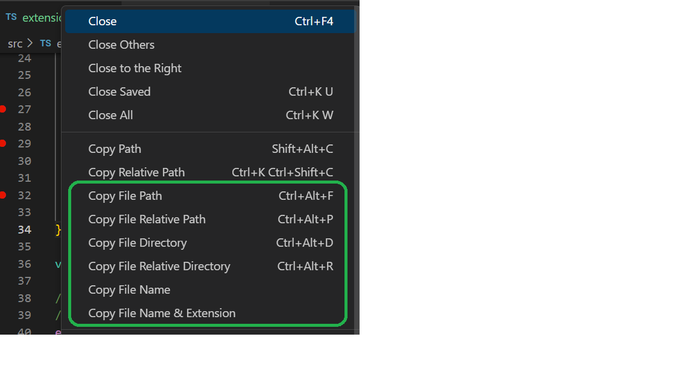
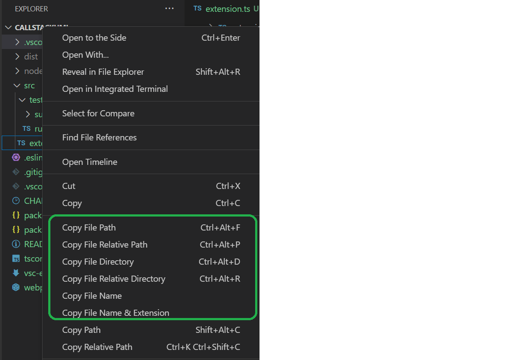

# Copy File Info

[](https://marketplace.visualstudio.com/items?itemName=JianpingCai.copy-file-info)
[](https://marketplace.visualstudio.com/items?itemName=JianpingCai.copy-file-info)
[](https://marketplace.visualstudio.com/items?itemName=JianpingCai.copy-file-info)
[](LICENSE)

A productivity extension for Visual Studio Code that makes it easy to copy file paths, names, and directory information to your clipboard with a single click or keyboard shortcut.

## ✨ Features

This extension provides **six commands** for copying file-related information to the clipboard. Access them from context menus in the editor, file explorer, or command palette:

### Available Commands

| Command | Description | Default Keybinding (Windows/Linux) | Mac |
|---------|-------------|-------------------------------------|-----|
| **Copy File Name** | File name without extension | - | - |
| **Copy File Name with Extension** | Full file name including extension | - | - |
| **Copy File Path** | Complete absolute path | `Ctrl+Alt+F` | `Cmd+Alt+F` |
| **Copy File Relative Path** | Path relative to workspace root | `Ctrl+Alt+P` | `Cmd+Alt+P` |
| **Copy File Directory** | Absolute directory path | `Ctrl+Alt+D` | `Cmd+Alt+D` |
| **Copy Relative File Directory** | Directory path relative to workspace | `Ctrl+Alt+R` | `Cmd+Alt+R` |

### 📋 Clipboard Feedback

Every successful copy operation displays a status bar message confirming what was copied, so you always know what's in your clipboard.

## 🎯 Usage

### From Editor Title Context Menu

Right-click on the file tab to access copy commands:



### From File Explorer Context Menu

Right-click on any file in the explorer:



### From Command Palette

1. Press `Ctrl+Shift+P` (Windows/Linux) or `Cmd+Shift+P` (Mac)
2. Type "Copy File"
3. Select your desired command

### Using Keyboard Shortcuts

Use the default keybindings or customize them in your keyboard shortcuts settings:

- `Ctrl+Alt+F` / `Cmd+Alt+F` - Copy File Path
- `Ctrl+Alt+P` / `Cmd+Alt+P` - Copy File Relative Path
- `Ctrl+Alt+D` / `Cmd+Alt+D` - Copy File Directory
- `Ctrl+Alt+R` / `Cmd+Alt+R` - Copy Relative File Directory

## 📦 Installation

1. Open VS Code
2. Press `Ctrl+P` / `Cmd+P` to open Quick Open
3. Type `ext install JianpingCai.copy-file-info`
4. Click Install

Or search for "Copy File Info" in the Extensions view (`Ctrl+Shift+X`).

## ⚙️ Requirements

- **Visual Studio Code** version 1.76.0 or higher
- **Workspace folder**: Some features (relative paths) require files to be part of a workspace
- **File system permissions**: The extension needs permission to read file paths
- **Clipboard access**: Required for copy operations

## 🔧 Configuration

Currently, this extension works out of the box with no configuration required. Future versions will include customizable settings for:

- Message display duration
- Path format preferences
- Custom message templates

## 🐛 Known Issues

No known issues at this time. If you encounter any problems, please [report them on GitHub](https://github.com/JianpingCAI/vs-copy-file-directory/issues).

## 📝 Release Notes

See [CHANGELOG.md](CHANGELOG.md) for detailed release history.

### 0.0.3 (Current)

- ✅ Six copy commands for different file information needs
- ✅ Context menu integration (editor title & file explorer)
- ✅ Keyboard shortcuts for quick access
- ✅ Status bar feedback messages
- ✅ Support for both active editor and explorer context

## 🤝 Contributing

Contributions are welcome! Please see [CONTRIBUTING.md](CONTRIBUTING.md) for guidelines.

### Development Setup

```bash
git clone https://github.com/JianpingCAI/vs-copy-file-directory.git
cd vs-copy-file-directory
npm install
code .
```

Press `F5` to run the extension in development mode.

## 💡 Tips & Tricks

- **Quick Copy**: Use keyboard shortcuts for the paths you copy most frequently
- **Relative Paths**: Great for sharing code locations with teammates in the same project
- **File Names**: Perfect for quickly referencing files in documentation or commit messages
- **Directory Paths**: Useful when navigating terminal or creating new files

## 🙏 Feedback & Support

- 🐛 [Report a bug](https://github.com/JianpingCAI/vs-copy-file-directory/issues)
- 💡 [Request a feature](https://github.com/JianpingCAI/vs-copy-file-directory/issues)
- ⭐ [Rate on Marketplace](https://marketplace.visualstudio.com/items?itemName=JianpingCai.copy-file-info&ssr=false#review-details)
- 📖 [Documentation](https://github.com/JianpingCAI/vs-copy-file-directory)

## 📄 License

[MIT](LICENSE) © Jianping Cai

---

**Enjoy coding! 🚀**
